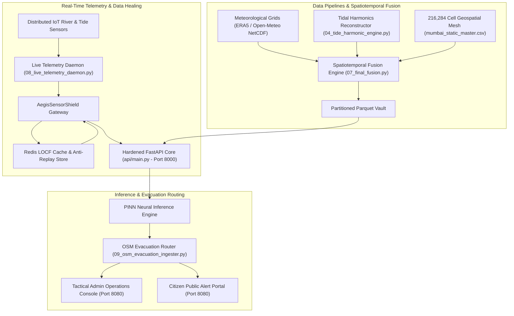

# Sentinel V7: Project Salsette (Mumbai Coastal Operations Runtime)

[](LICENSE)
[](https://fastapi.tiangolo.com)
[](https://pytorch.org)
[](https://huggingface.co/abdullahashraf122/sentinel-mumbai-pinn-v1)
[](https://huggingface.co/datasets/abdullahashraf122/mumbai-salsette-flood-intelligence-2005-2023)
[](https://www.python.org/)
[](https://www.docker.com/)

> **Air-Gapped, Zero-Cloud-Dependency Municipal Flood Intelligence and Emergency Response Runtime for the Mumbai Metropolitan Region.**

Project Salsette (Sentinel V7 — Konkan-Aegis Protocol) models and mitigates coastal surge flooding, urban outfall backpressure, and monsoon inundation across **216,284 discrete geographic grid cells** (100m × 100m resolution) spanning Salsette Island and adjacent mainland drainage corridors.

---

## 🏛 System Architecture



---

## ⚡ Key Capabilities

### 1. 216,284 Geospatial Grid Mesh (100m Resolution)
- Models Mumbai’s topography from Apollo Bunder to Manori Creek at high resolution.
- Computes vectorized topographic slopes and hydraulic gravity drainage gradients:
  $$\text{slope} = \arctan\left(\frac{\Delta \text{elevation}}{\Delta \text{distance}}\right)$$
- Integrates WorldPop density matrices and land-cover permeability models.

### 2. Hydrodynamic Tidal Harmonics Engine
- Reconstructs real-time water levels using astronomical harmonic constituents calibrated at Apollo Bunder:
  $$h(t) = H_0 + \sum_{i=1}^{5} H_i \cos(a_i t - g_i)$$
  - **$H_0$**: $2.50\text{ m}$ (Chart Datum baseline offset)
  - **$M_2$**: Main Lunar Semidiurnal ($a = 28.984^\circ/\text{hr}$, $H = 1.15\text{m}$, $g = 330^\circ$)
  - **$S_2$**: Main Solar Semidiurnal ($a = 30.000^\circ/\text{hr}$, $H = 0.45\text{m}$, $g = 5^\circ$)
  - **$N_2, K_1, O_1$**: Lunar elliptic and diurnal constituents
- Detects coastal sluice gate lockouts and outfall backpressure in real time.

### 3. Physics-Informed Neural Network (PINN) Inference
- Couples Saint-Venant shallow water equations with deep spatial priors.
- Evaluates mass-balance conservation and dynamic backpressure penalties during storm surges.

### 4. AegisSensorShield Data Healing & Zero-Trust Core
- **Sensor Glitch Mitigation**: Last-Observation-Carried-Forward (LOCF) rolling cache backed by Redis.
- **HMAC SHA-256 Nonce Verification**: Rejects sensor replay and forged telemetry payloads.
- **HashiCorp Vault Secrets**: Secure local key rotation for device verification and AES-GCM encrypted persistence.

### 5. Multi-Tier Tactical Dashboards
- **Tactical Admin Console (`/web/admin`)**: Real-time flood gate management, water levels, pump overrides, and telemetry feeds.
- **Citizen Survival Portal (`/web/citizen`)**: Lightweight PWA with offline caching, safe evacuation routes, and emergency shelter guidance.

---

## 📂 Repository Structure

```text
MUMBAI_mlc/
├── HUFP_mumbai/
│   ├── api/                     # FastAPI core, security middleware, and vault manager
│   │   ├── main.py              # Central REST and WebSocket endpoints
│   │   ├── security_middleware.py # HMAC integrity & anti-replay verification
│   │   ├── vault_manager.py     # Local HashiCorp Vault client
│   │   └── dashboard_service.py # Telemetry aggregation & spatial analytics
│   ├── field_survey_ops/        # Sensor calibration & elevation auditing
│   ├── iot/                     # Edge C++ sensor firmware & Nginx proxy configs
│   ├── showcase/                # Hydrodynamic simulation benchmarks & charts
│   ├── src/                     # Core model definitions (Bi-LSTM, PINN)
│   ├── web/
│   │   ├── admin/               # Tactical municipal command dashboard
│   │   └── citizen/             # Citizen emergency alert & evacuation PWA
│   ├── 01_init_mumbai_grid.py   # Coordinate mesh generator
│   ├── 04_tide_harmonic_engine.py # Apollo Bunder astronomical tide solver
│   ├── 07_final_fusion.py       # Spatiotemporal fusion engine
│   ├── 08_live_telemetry_daemon.py # Distributed sensor poller
│   └── 09_osm_evacuation_ingester.py # OpenStreetMap routing engine
├── investor_ppt.html            # Interactive executive presentation
├── clients_data.js              # Sector intelligence and resilience targets
├── .env.example                 # Configuration template
├── LICENSE                      # MIT License
└── README.md                    # System documentation
```

---

## 🚀 Quickstart & Setup

### Prerequisites
- Python 3.10+
- (Optional) Redis server for distributed LOCF caching
- (Optional) HashiCorp Vault for hardware-backed key rotation

### 1. Clone & Configure
```bash
git clone https://github.com/abdullah00ashraf/sentinel-v7-mumbai.git
cd sentinel-v7-mumbai
cp .env.example .env
```

### 2. Install Dependencies
```bash
cd HUFP_mumbai
pip install -r requirements.txt
```

### 3. Launch the API Core
```bash
uvicorn api.main:app --host 0.0.0.0 --port 8000 --reload
```

### 4. Run Telemetry Daemon (Simulated or Live Feed)
```bash
python 08_live_telemetry_daemon.py
```

### 5. Access Dashboards
- **Tactical Admin Operations**: `http://localhost:8000/web/admin/`
- **Citizen Alert Portal**: `http://localhost:8000/web/citizen/`
- **Interactive Documentation**: `http://localhost:8000/docs`

---

## 🤗 Pretrained Models & Fused Datasets on Hugging Face

The production neural weights and multi-decadal spatiotemporal Parquet datasets for Project Salsette are published and maintained on Hugging Face:

### 1. Neural Models
* **`sentinel-mumbai-pinn-v1`** (PyTorch, 20M+ parameters):  
  [`https://huggingface.co/abdullahashraf122/sentinel-mumbai-pinn-v1`](https://huggingface.co/abdullahashraf122/sentinel-mumbai-pinn-v1)  
  *6-Layer Bi-LSTM with self-attention and custom Log-Cosh + Hydraulic Lock mass conservation loss constraint.*
* **`sentinel-mumbai-hybrid-pinn-keras`** (Keras 3, mixed precision):  
  [`https://huggingface.co/abdullahashraf122/sentinel-mumbai-hybrid-pinn-keras`](https://huggingface.co/abdullahashraf122/sentinel-mumbai-hybrid-pinn-keras)  
  *Attention-augmented PINN with continuity PDE residual $\frac{\partial \hat{y}}{\partial t} - (\text{Rainfall} - \text{Infiltration}) = 0$.*

### 2. Multi-Decadal Fused Dataset
* **`mumbai-salsette-flood-intelligence-2005-2023`** (27.84 GB, 633 Million Records):  
  [`https://huggingface.co/datasets/abdullahashraf122/mumbai-salsette-flood-intelligence-2005-2023`](https://huggingface.co/datasets/abdullahashraf122/mumbai-salsette-flood-intelligence-2005-2023)  
  *19 annual Parquet partitions fusing Sentinel-1 SAR water masks, NASA DEM, ERA5 weather, and MCGM 1-min tide gauges.*

```python
# Quickstart: Download Model Weights via huggingface_hub
from huggingface_hub import hf_hub_download
import torch

weights_path = hf_hub_download(
    repo_id="abdullahashraf122/sentinel-mumbai-pinn-v1",
    filename="sentinel_mumbai_v1.pt"
)
state_dict = torch.load(weights_path, map_location="cpu")
print("Sentinel-Mumbai PINN weights loaded successfully!")
```

---

## 🔒 Security & Data Hygiene

This codebase has undergone automated static analysis:
- **Zero Hardcoded Secrets**: All cryptographic tokens and API keys are externalized through environment variables and local secret stores.
- **Isolated Large Datasets**: Production datasets (>28 GB multi-year parquet files and >100 MB model weights) are hosted on Hugging Face with Git LFS and excluded from repository bloat.
- **Air-Gapped Operation**: Designed to function completely disconnected from public clouds during extreme disaster scenarios.

---

## 📄 License

This project is licensed under the MIT License — see the [LICENSE](LICENSE) file for details.

Developed with precision for municipal resilience and humanitarian safety.
