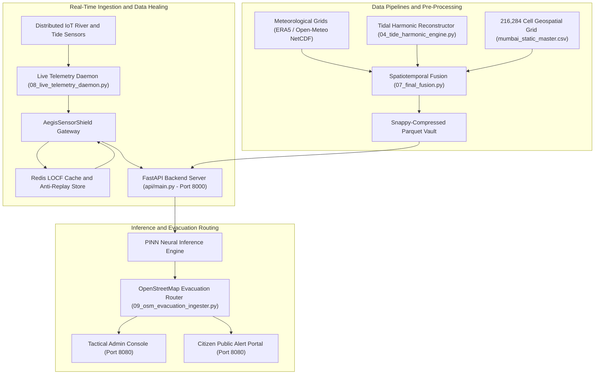

# Project Salsette (Sentinel V7): Municipal Operations & Ingestion Runtime

## 1. System Overview
**Project Salsette (Sentinel V7 — Konkan-Aegis Protocol)** is an air-gapped, zero-cloud-dependency municipal flood intelligence and emergency response runtime designed for the Mumbai metropolitan region. The platform performs continuous spatial risk scoring, hydrodynamic tidal calculations, and real-time sensor ingestion across **216,284 discrete geographic grid cells** (100m $\times$ 100m resolution).

The runtime bridges physical oceanographic boundary conditions with distributed IoT telemetry feeds. It couples an asynchronous ingestion daemon, a hardened FastAPI core (port `8000`) protected by the `AegisSensorShield` data healing layer, and a tactical browser-based operations interface (port `8080`) delivering real-time emergency routing to first responders and civil protection teams.

---

## 2. Architectural Topology



---

## 3. Core Subsystems & Technical Specifications

### 3.1 Geospatial Grid Mesh Architecture
The Mumbai operational zone (Salsette Island and adjacent mainland drainage corridors) is discretized into **216,284 cells** indexed with coordinate centroids, surface elevations, and dynamic slopes.

* **Topographic Slope Computation:**
  $$\text{slope} = \arctan\left(\frac{\Delta \text{elevation}}{\Delta \text{distance}}\right)$$
* **Static Normalization:** Integrates WorldPop raster density models to establish demographic vulnerability weights, cross-referenced with regional soil permeability matrices.

```python
# File: 07_final_fusion.py
print("Loading Static Skeleton (216,284 Grid Cells)...")
static_df = pd.read_csv(STATIC_MASTER)

# Vectorized Slope Extraction
static_df['slope'] = np.arctan(static_df['elevation_m'].diff().fillna(0)).astype('float32')
static_df['landcover_class'] = static_df['landcover_class'].astype('float32')
```

---

### 3.2 Hydrodynamic Tidal Harmonics Engine
Mumbai’s stormwater drains rely on gravity discharge into the Arabian Sea. During peak monsoon rainfall, high astronomical tides ($> 4.5\text{ m}$) prevent outfall drainage, causing immediate urban backflow. The system models water levels mathematically using astronomical constituents derived from long-term observations at **Apollo Bunder**.

* **Harmonic Summation Equation:**
  $$h(t) = H_0 + \sum_{i=1}^{5} H_i \cos(a_i t - g_i)$$
  * $H_0 = 2.50\text{ m}$ (Mumbai Chart Datum Offset)
  * $M_2$: Main Lunar Semidiurnal ($a = 28.984^\circ/\text{hr}$, $H = 1.15\text{m}$, $g = 330^\circ$)
  * $S_2$: Main Solar Semidiurnal ($a = 30.000^\circ/\text{hr}$, $H = 0.45\text{m}$, $g = 5^\circ$)
  * $N_2$: Lunar Elliptic, $K_1$: Luni-Solar Diurnal, $O_1$: Principal Lunar Diurnal

```python
# File: 04_tide_harmonic_engine.py
class TideHarmonicEngine:
    def __init__(self):
        self.constituents = {
            'M2': {'amp': 1.15, 'phase': 330.0, 'speed': 28.9841042},
            'S2': {'amp': 0.45, 'phase': 5.0,   'speed': 30.0000000},
            'N2': {'amp': 0.22, 'phase': 315.0, 'speed': 28.4397295},
            'K1': {'amp': 0.18, 'phase': 185.0, 'speed': 15.0410686},
            'O1': {'amp': 0.12, 'phase': 150.0, 'speed': 13.9430356},
        }
        self.mean_sea_level = 2.5 # Chart Datum offset

    def calculate_instant(self, target_time):
        t0 = datetime(2004, 1, 1)
        hours_since_epoch = (target_time - t0).total_seconds() / 3600.0
        tide_height = self.mean_sea_level
        for name, c in self.constituents.items():
            angle = np.radians(c['speed'] * hours_since_epoch - c['phase'])
            tide_height += c['amp'] * np.cos(angle)
        return tide_height
```

---

### 3.3 Out-of-Core Spatiotemporal Data Fusion
The fusion engine binds temporal weather grids with spatial elevation layers without exhausting system memory:
* Utilizes **Xarray** to lazily stream multi-dimensional meteorological NetCDF files (`tp` total precipitation, runoff).
* Partitions data streams into **24-hour execution chunks**.
* Serializes outputs into Snappy-compressed **PyArrow Parquet** tables, ensuring processing remains strictly under 4GB RAM.

```python
# File: 07_final_fusion.py
ds = xr.open_dataset(nc_path, engine='netcdf4')
# Streamed chunk serialization
table = pa.Table.from_pandas(merged_day_df)
pq.write_table(table, output_file, compression='snappy')
```

---

### 3.4 Production Ingestion Resilience: `AegisSensorShield`
During severe monsoons, remote physical IoT gauges frequently brown out or transmit corrupt `NaN`/`Inf` floating-point records. A single unhandled `NaN` corrupts subsequent tensor computations. The system intercepts all incoming telemetry out-of-band:
1. **Redis LOCF:** Performs a **Last Observation Carried Forward** lookup in a low-latency Redis cache.
2. **Deterministic Fallback:** If cache data is unavailable, falls back directly to `TideHarmonicEngine` to compute instantaneous physical sea height.

```python
# File: api/main.py
class AegisSensorShield:
    @staticmethod
    async def sanitize(payload: Dict[str, Any]) -> Dict[str, Any]:
        for k, v in payload.items():
            if v is None or (isinstance(v, float) and (np.isnan(v) or np.isinf(v))):
                # 1. Query Redis for Last Observation Carried Forward (LOCF)
                redis_key = f"sensor_locf:{k}"
                locf_val = await redis_client.get(redis_key)
                if locf_val is not None:
                    payload[k] = float(locf_val)
                else:
                    # 2. Physics-based mathematical reconstruction
                    if k == "tide_m":
                        payload[k] = TideHarmonicEngine().calculate_instant(datetime.now())
                    elif k == "rainfall_mm":
                        payload[k] = 0.0 # Fail-safe conservative baseline
        return payload
```

---

### 3.5 Anti-Replay Cryptographic Gateway
To safeguard emergency communication loops from unauthorized spoofing or adversarial replay attacks:
* Ingests authenticated payloads via AES-GCM decryption.
* Validates unique transaction nonces against an in-memory Redis token vault with a strict time-to-live (TTL). Replayed telemetry packets are dropped at the middleware boundary.
* Dynamically manages CORS headers allowing secure inspection from local `file://` protocols and air-gapped terminal views.

```python
# File: api/main.py
app.add_middleware(
    CORSMiddleware,
    allow_origins=_cors_origins(),
    allow_origin_regex=".*",
    allow_credentials=True,
    allow_methods=["GET", "POST", "OPTIONS"],
    allow_headers=["*"],
    expose_headers=["X-Signature", "X-Timestamp", "X-Nonce"],
)
```

---

### 3.6 Evacuation Routing & Transport Matrix Forge
* **File:** [`HUFP_mumbai/09_osm_evacuation_ingester.py`](file:///c:/Producttolaunch/MUMBAI_mlc/HUFP_mumbai/09_osm_evacuation_ingester.py), [`forge_transport_matrix.py`](file:///c:/Producttolaunch/MUMBAI_mlc/forge_transport_matrix.py)
* Translates predicted water levels into transport viability. Road segments from OpenStreetMap are intersected with predicted inundation depths.
* Segments exceeding vehicle wading parameters ($> 300\text{ mm}$ for emergency ambulances) are dynamically pruned, recalculating optimal transit routes to designated high-ground triage centers.

---

## 4. Multi-Process Deployment Orchestration

The production environment is orchestrated via PowerShell ([`launch_sentinel.ps1`](file:///c:/Producttolaunch/MUMBAI_mlc/launch_sentinel.ps1)), running three concurrent services:

```powershell
# Background Telemetry Ingestion Daemon
Start-Process -FilePath "python" -ArgumentList "08_live_telemetry_daemon.py" -WorkingDirectory ".\HUFP_mumbai"

# FastAPI Backend Inference Core (Port 8000)
Start-Process -FilePath "uvicorn" -ArgumentList "api.main:app --host 127.0.0.1 --port 8000 --reload" -WorkingDirectory ".\HUFP_mumbai"

# Tactical Static UI Server (Port 8080)
Start-Process -FilePath "python" -ArgumentList "-m http.server 8080" -WorkingDirectory "."
```

### Primary Service Endpoints

| Service | Port | Endpoint URL | Description |
|---|---|---|---|
| **FastAPI Backend Core** | `8000` | `http://127.0.0.1:8000/docs` | OpenAPI documentation, `/api/v1/inference`, `/ws/audit` |
| **Tactical Admin Console** | `8080` | `http://127.0.0.1:8080/HUFP_mumbai/web/admin/index.html` | Municipal dispatch cockpit & sensor telemetry |
| **Expert Operations Deck** | `8080` | `http://127.0.0.1:8080/HUFP_mumbai/web/admin/expert.html` | High-fidelity engineering dashboard & manual overrides |
| **Citizen Warning Portal** | `8080` | `http://127.0.0.1:8080/HUFP_mumbai/web/citizen/index.html` | Public localized alert feed & nearest evacuation routes |

---

## 5. File Map & Subsystem Responsibilities

| File Path | Subsystem | Responsibility |
|---|---|---|
| [`HUFP_mumbai/api/main.py`](file:///c:/Producttolaunch/MUMBAI_mlc/HUFP_mumbai/api/main.py) | API Gateway | FastAPI application, `AegisSensorShield`, WebSocket audit stream. |
| [`HUFP_mumbai/api/security_middleware.py`](file:///c:/Producttolaunch/MUMBAI_mlc/HUFP_mumbai/api/security_middleware.py) | Security | Cryptographic token verification, Redis anti-replay nonce tracking. |
| [`HUFP_mumbai/04_tide_harmonic_engine.py`](file:///c:/Producttolaunch/MUMBAI_mlc/HUFP_mumbai/04_tide_harmonic_engine.py) | Hydrodynamics | Astronomical harmonic tide calculations (Apollo Bunder). |
| [`HUFP_mumbai/07_final_fusion.py`](file:///c:/Producttolaunch/MUMBAI_mlc/HUFP_mumbai/07_final_fusion.py) | Data Fusion | Out-of-core NetCDF + tidal table processing into PyArrow Parquet. |
| [`HUFP_mumbai/08_live_telemetry_daemon.py`](file:///c:/Producttolaunch/MUMBAI_mlc/HUFP_mumbai/08_live_telemetry_daemon.py) | Ingestion | Continuous background worker polling live precipitation and wave data. |
| [`HUFP_mumbai/09_osm_evacuation_ingester.py`](file:///c:/Producttolaunch/MUMBAI_mlc/HUFP_mumbai/09_osm_evacuation_ingester.py) | Evacuation | OpenStreetMap vector extraction and flood-road intersection graphs. |
| [`forge_transport_matrix.py`](file:///c:/Producttolaunch/MUMBAI_mlc/forge_transport_matrix.py) | Dispatch | Aztec-encoded tactical asset dispatch generator. |
| [`launch_sentinel.ps1`](file:///c:/Producttolaunch/MUMBAI_mlc/launch_sentinel.ps1) | Orchestration | Multi-process daemon bootstrap and shutdown management. |

---

## 6. 🤗 Hugging Face Models & Spatiotemporal Datasets

The production neural weights and multi-decadal spatiotemporal Parquet datasets for Project Salsette are published on Hugging Face:

* **PyTorch PINN Model**: [`abdullahashraf122/sentinel-mumbai-pinn-v1`](https://huggingface.co/abdullahashraf122/sentinel-mumbai-pinn-v1)
  - 20M-parameter Bi-LSTM + Self-Attention with Log-Cosh + Hydraulic Lock mass conservation loss.
  - Weight file `sentinel_mumbai_v1.pt` and standalone `inference.py`.
* **Keras Mixed-Precision PINN**: [`abdullahashraf122/sentinel-mumbai-hybrid-pinn-keras`](https://huggingface.co/abdullahashraf122/sentinel-mumbai-hybrid-pinn-keras)
  - Dual Bi-LSTM PINN with continuity PDE residual $\frac{\partial \hat{y}}{\partial t} - (\text{Rain} - \text{Infil}) = 0$.
* **Multi-Decadal Fused Dataset**: [`abdullahashraf122/mumbai-salsette-flood-intelligence-2005-2023`](https://huggingface.co/datasets/abdullahashraf122/mumbai-salsette-flood-intelligence-2005-2023)
  - 19 annual Snappy-compressed Parquet partitions (27.84 GB, 633 Million rows) covering 2005–2023 across 216,284 spatial cells.

